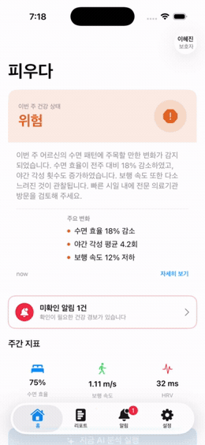
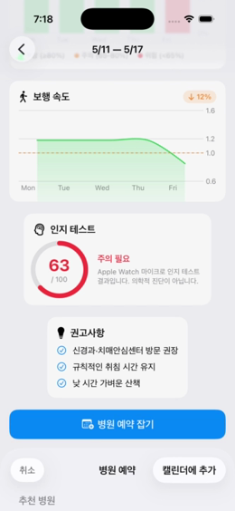
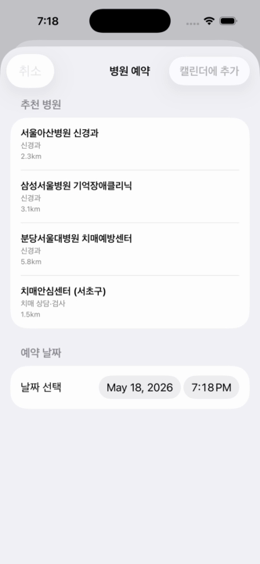
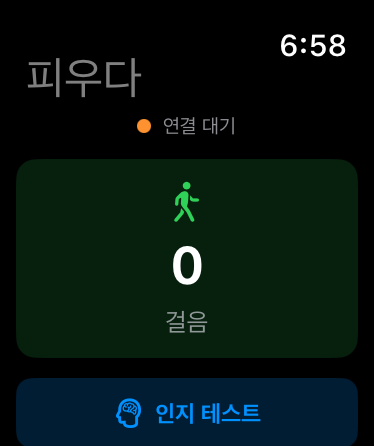

<div align="center">

# 🌸 피우다 (Piuda)

### 가족이 멀리 있어도, 부모님의 뇌 건강을 매일 곁에서 지킵니다

Apple Watch가 수집한 일상 데이터를 **Upstage Solar LLM**이 매일 분석해,
치매가 의심되는 변화를 **자녀가 알아채기 전에** 먼저 알려주는 AI Agent 플랫폼

<br/>

[](https://upstage.ai)
[](https://developer.apple.com)
[](https://claude.ai/code)
[](https://opensource.org/licenses/MIT)

<sub>JNU × Upstage Skillthon — 2026 전남대학교 소프트웨어중심대학 디지털 경진대회 출품작</sub>

<br/>



</div>

---

## 🩺 어떤 문제를 푸나요?

> 부모님의 치매는 **이미 진행된 뒤에야** 가족의 눈에 띕니다.

- 보건소 인지선별검사(CIST)는 **1년에 한 번**. 그 사이의 변화는 아무도 추적하지 않습니다.
- 자녀가 명절에 만나 "엄마 말이 줄었네" 느낄 즈음엔 이미 경도인지장애(MCI)가 진행 중입니다.
- 카카오톡 안부 인사로는 *"괜찮다"* 는 대답밖에 받지 못합니다.

**피우다는 진단하지 않습니다.** 대신 노인이 매일 차는 Apple Watch에서
수면·보행·심박·인지 데이터를 모아, 의미 있는 변화가 보일 때 자녀에게
**객관적인 근거와 함께** 알려줍니다.

| | 노인 (착용자) | 보호자 (자녀) |
|---|---|---|
| **하는 일** | Apple Watch만 착용 · 주 1회 30초 인지 테스트 | iPhone 앱으로 주간 리포트 확인 |
| **얻는 것** | 존엄을 지키며 가족과 연결됨 | 죄책감 대신 객관적 근거에 기반한 케어 |

---

## 📱 화면 미리보기

<div align="center">

| 홈 — AI 위험 분석 | 주간 리포트 | 병원 예약 자동화 | Apple Watch |
|:---:|:---:|:---:|:---:|
|  |  |  |  |
| Solar LLM이 쓴 한국어 위험 분석과 주간 지표 | 보행 속도 추세 · 인지 테스트 점수 · 권고사항 | 가까운 신경과·치매안심센터 추천 + 캘린더 연동 | 노인용 화면 — 걸음 수와 인지 테스트 |

</div>

---

## ⚙️ 어떻게 동작하나요?

```
   Apple Watch                iPhone                     Upstage Solar LLM
┌──────────────┐   Watch    ┌──────────────────┐        ┌──────────────────┐
│ 수면 · 걸음   │ Connectivity│ HealthKit 수집   │  API   │ 한국어 주간 리포트 │
│ 심박 · HRV    │ ─────────► │ + 위험 점수 계산 │ ─────► │ 위험 수준 판정     │
│ 인지 테스트   │            │   (0–20점)       │        │ 보호자 알림 메시지 │
└──────────────┘            └──────────────────┘        └──────────────────┘
                                     │                            │
                                     └──── moderate 이상 ──────────┘
                                              │
                                   보호자 푸시 알림 + 병원 예약 추천
```

### 위험 점수 알고리즘 (0–20점)

| 지표 | 정상 기준 | 배점 |
|------|-----------|------|
| 수면 효율 | ≥ 85% | 0–4점 |
| 야간 각성 횟수 | ≤ 2회 | 0–3점 |
| 보행 속도 | ≥ 1.0 m/s | 0–4점 |
| HRV (SDNN) | ≥ 30 ms | 0–3점 |
| 일일 걸음 수 | ≥ 5,000보 | 0–3점 |
| 인지 테스트 점수 | ≥ 80점 | 0–3점 |

| 점수 | 수준 | 동작 |
|---|---|---|
| 0–5 | 🟢 낮음 | 정기 모니터링 |
| 6–10 | 🟡 보통 | 보호자 알림 발송 |
| 11–15 | 🟠 높음 | 병원 방문 권고 |
| 16–20 | 🔴 위험 | 즉시 병원 예약 |

---

## 📊 데이터 — 실제 의료 데이터 기반

피우다의 지표 정의, 위험 점수 기준, 데모/샘플 데이터는 임의로 지어낸 수치가
아니라 **AI-Hub의 실제 의료 데이터셋**을 근거로 설계되었습니다.

**데이터셋: AI-Hub「치매 고위험군 웨어러블 라이프로그」**

| 구축 항목 | 제공 데이터량 |
|---|---|
| 라이프로그 데이터 (수면 정보) | 15,000건 |
| 라이프로그 데이터 (걸음거리 정보) | 15,000건 |
| 인지기능 데이터 (MMSE) | 9,000건 |
| 치매 고위험군 라벨링 | 300건 |

**구축 참여기관**

| 기관 | 역할 |
|---|---|
| 조선대학교 산학협력단 | 데이터 수집 · 품질검증 |
| (주)로완 | 데이터 수집 및 정제 · 품질검증 |
| 광주과학기술원(GIST) | 데이터 가공(전처리) · AI 모델 개발 |
| (주)비온시이노베이터 | AI 활용 응용서비스 개발 |

수면 라이프로그 → 수면 효율·야간 각성·HRV·안정시 심박, 걸음거리 라이프로그
→ 일일 걸음 수, MMSE 검사 → 인지 테스트 점수로 매핑됩니다. 따라서 피우다의
입력 스키마와 위험 판정 기준은 실제 치매 고위험군 코호트의 데이터 분포에
기반합니다.

> 원천 CSV를 스킬 입력 형식으로 변환하는 도구는 별도 `data_pipeline`
> 스크립트로 제공되며, 진단군(정상군 CN / 경도인지장애 MCI / 치매군 Dem)별
> 대표 피험자 데이터를 재현합니다. 개인정보 보호를 위해 원천 데이터 자체는
> 저장소에 포함하지 않습니다.

---

## 📦 이 레포의 구성

피우다는 두 개의 [Anthropic Skill](https://docs.anthropic.com/en/docs/claude-code/) 로 제출되었습니다.

| Skill | 설명 |
|---|---|
| [`skills/piuda`](skills/piuda/SKILL.md) | iOS + watchOS 앱 전체 — HealthKit 수집, 위험 점수 계산, Solar LLM 연동, 병원 예약 |
| [`skills/brain-health-weekly-report`](skills/brain-health-weekly-report/SKILL.md) | 주간 건강 데이터(JSON) → 보호자용 한국어 리포트를 만드는 독립 실행형 Python 스킬 |

### 🚀 주간 리포트 스킬 바로 실행해보기

```bash
cd skills/brain-health-weekly-report
pip install -r scripts/requirements.txt

# Upstage API 키 설정
cp assets/.env.example assets/.env   # assets/.env 에 UPSTAGE_API_KEY 입력

python scripts/generate_report.py assets/sample_week.json
```

샘플 데이터(`sample_week.json`)는 수면 효율 78→65, 새벽 각성 1.1→3.3회로
여러 지표가 동시에 악화된 한 주입니다. 정상 동작 시 위험 수준이
`관찰 권장` 또는 `주의 필요` 로 나옵니다.

---

## 🛠 기술 스택

| 레이어 | 기술 |
|--------|------|
| AI 분석 | Upstage Solar LLM (`solar-pro`) |
| 건강 데이터 | Apple HealthKit |
| Watch ↔ iPhone | WatchConnectivity |
| 백엔드 | Firebase Firestore + FCM *(선택 — 없으면 Mock 데이터로 동작)* |
| 병원 예약 | EventKit |
| 차트 | Swift Charts |
| 상태 관리 | `@Observable` (iOS 17+) |

### iOS 앱 빌드

```
1. Xcode → skills/piuda/scripts/piuda.xcodeproj 열기
2. piuda 타겟 → Signing & Capabilities → Team 선택
3. HealthKit capability 추가 (iOS + watchOS 타겟 모두)
4. 설정 탭에서 Upstage API 키 입력 후 Build & Run
```

---

## ⚖️ 면책

피우다는 **의료기기가 아닌 wellness(생활 건강) 도구**입니다.
치매를 포함한 어떤 질병도 진단·단정하지 않으며, 일상 데이터의 변화를
가족에게 전달할 뿐입니다. 모든 리포트는 *"의학적 진단이 아닙니다"* 를 명시하며,
한 번의 잘못된 경보가 가족 관계를 해치지 않도록 **침착하고 비난 없는 어조**를
설계 원칙으로 삼습니다.

---

<details>
<summary><b>🎓 Skillthon 참가 안내 — Upstage 크레딧 $70 무료 지원</b></summary>

<br/>

대회 참가자 전원에게 **Upstage API 크레딧 $70**을 무료로 지원합니다.

1. [console.upstage.ai](https://console.upstage.ai) 회원가입 / 로그인
2. **Dashboard → Billing → Credit → Redeem code**
3. 아래 코드 입력

   ```
   UPWAVE-KOH
   ```


| 문서 | 설명 |
|------|------|
| [Claude Code Docs](https://docs.anthropic.com/en/docs/claude-code/) | Skills · Plugins · Marketplace |
| [Upstage Console Docs](https://console.upstage.ai/docs/capabilities) | Solar LLM, Embeddings, Document Parse |
| [Upstage API Spec](https://console.upstage.ai/api/docs/for-agents/raw) | Agent용 머신 리더블 스펙 |

</details>

---

## 📮 문의

- **Skillthon 운영:** 조아라 연구원 / 고범수 — [rha852@jnu.ac.kr](mailto:rha852@jnu.ac.kr) · [gobeumsu@gmail.com](mailto:gobeumsu@gmail.com)

<div align="center">
<sub>🌸 꽃이 피어나듯, 건강하게 — Piuda</sub>
</div>
